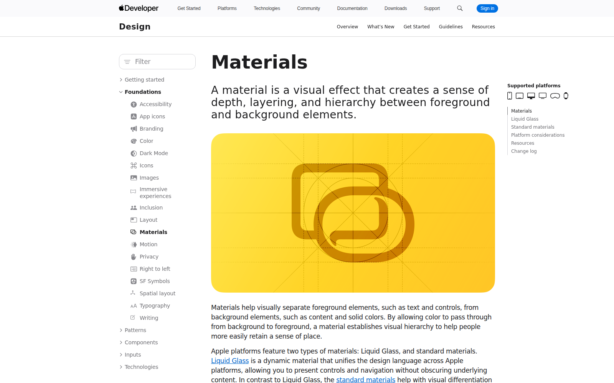
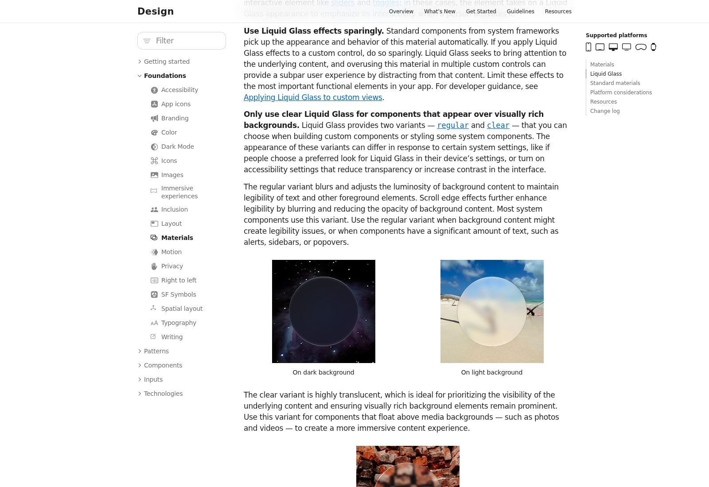
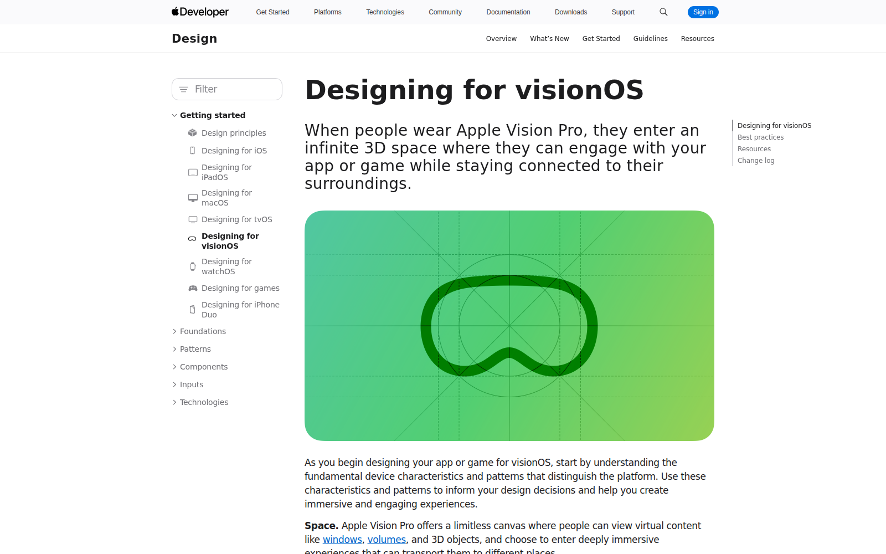
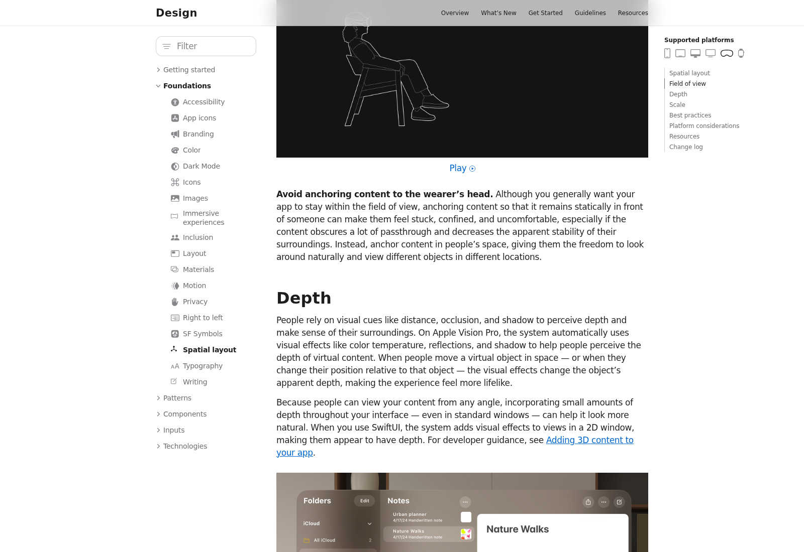
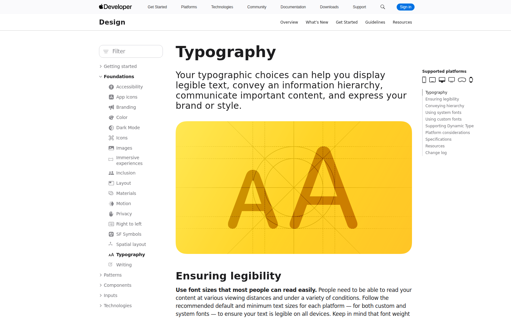
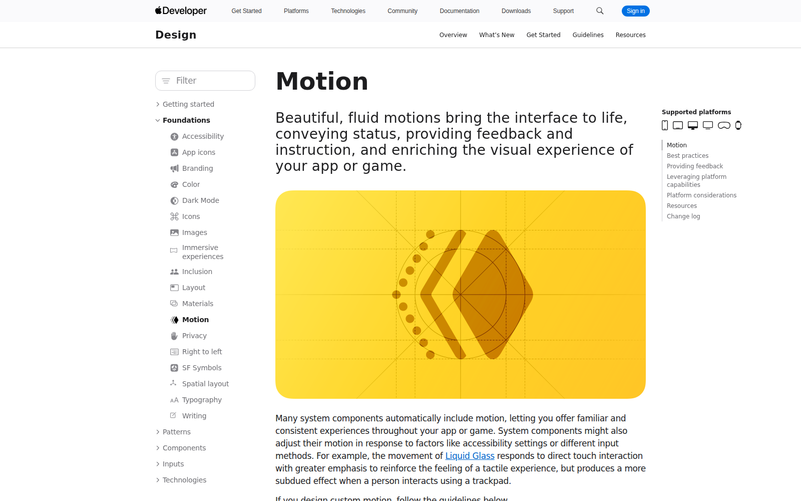
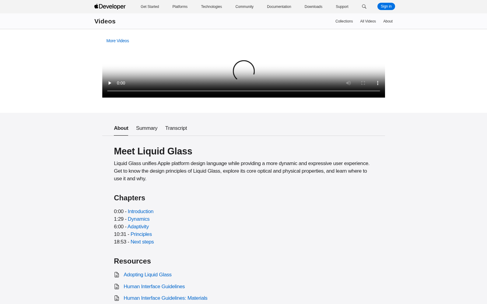

# Pro UI references for MacBook layout A (2026-09-28)

FilthE: "improve the UI, look for professional references... really futuristic, modern, really advanced, like
some Apple ads." Target screen: `docs/design/macbook/a-cockpit.html` + `batcave.css` (current look = a Batman-cave
tactical HUD — dark glass monitors, corner brackets, scan lines, segmented gauges; see `notes.md` and
`shots/batcave-*.png`). This file is research only — the mockups are untouched.

**Mid-round brief add (still FilthE, same day):** push further — "a premium AI look with abstract generative
forms, cinematic scroll interactions, immersive WebGL scenes, luxury typography and a dark futuristic aesthetic
that feels alive." That changes the ask from "restyle one screen" into two different jobs, handled separately
below: the **work screens** (Now/Knock/Job, must stay fast/readable, no scroll-jacking) and the **landing +
big moments** (can go full cinematic).

## A network note, upfront
This sandbox's egress proxy allows only a short allowlist (`developer.apple.com`, `en.wikipedia.org`,
`fonts.googleapis.com`, npm/GitHub infra). `apple.com` marketing pages, `linear.app`, `stripe.com`, `vercel.com`,
`raycast.com`, `arc.net`, `palantir.com`, `anduril.com`, `bloomberg.com`, `territorystudio.com`,
`experienceperception.com`, `awwwards.com`, `lusion.co`, `activetheory.net`, `gsap.com`, `threejs.org` all
returned a **403 policy denial** on WebFetch, curl-through-proxy, and Playwright/Chromium alike (not a TLS or
cert problem — confirmed via `/__agentproxy/status`). Per the proxy's own instructions, a 403 org-policy denial
is reported, not routed around. So: **7 real screenshots below are from developer.apple.com** (actually opened,
actually rendered by Chromium). Everything else is written up from search-engine results (their own source
pages, cited) plus well-established industry knowledge, flagged **[no image: host blocked]** — not independently
re-verified by opening the page myself. Code/FilthE: if this matters, the fix is widening the session's egress
allowlist for the design-reference sites, not a retry.

## References

### 1. Apple HIG — Materials (Liquid Glass)
[developer.apple.com/design/human-interface-guidelines/materials](https://developer.apple.com/design/human-interface-guidelines/materials)
·  · 
**Steal:** two variants, not one glass — *regular* (blurs + relights background luminosity so text on top stays
legible; used for anything with real content like sidebars/alerts) vs *clear* (barely-there, only over rich
photo/video backgrounds). Batcave's `.card`/`.zcard` currently use one dark gradient recipe everywhere; Apple
never blurs a busy background without also adjusting its luminosity first.

### 2. Apple HIG — Designing for visionOS + Spatial Layout (Depth)
[…/designing-for-visionos](https://developer.apple.com/design/human-interface-guidelines/designing-for-visionos) ·
[…/spatial-layout](https://developer.apple.com/design/human-interface-guidelines/spatial-layout)
·  · 
**Steal, verbatim from the page:** "People rely on visual cues like distance, occlusion, and shadow to perceive
depth... the system automatically uses color temperature, reflections, and shadow... incorporating small
amounts of depth throughout your interface — even in standard windows — can help it look more natural." Batcave
gets depth from box-shadow only; Apple's version also shifts color temperature per layer.

### 3. Apple HIG — Typography
[…/typography](https://developer.apple.com/design/human-interface-guidelines/typography) ·

**Steal:** legibility-first sizing, then hierarchy through weight before size — Apple's number-heavy screens
(Health, Stocks) still read as calm because only 1-2 weight steps carry emphasis, not a dozen font sizes.

### 4. Apple HIG — Motion
[…/motion](https://developer.apple.com/design/human-interface-guidelines/motion) ·

**Steal, verbatim:** "the movement of Liquid Glass responds to direct touch interaction with greater emphasis...
but produces a more subdued effect when a person interacts using a trackpad" — motion intensity should match
input method, not the same tween for a click as a drag. Also the HIG's own line for the "living" ask: avoid
motion that's "overwhelming, jarring, too fast, or missing a stationary frame of reference."

### 5. WWDC25 "Meet Liquid Glass" session page
[developer.apple.com/videos/play/wwdc2025/219](https://developer.apple.com/videos/play/wwdc2025/219/) ·

**Steal:** Apple's own framing — glass is "a meta-material" that "dynamically bends and shapes light," not a
literal frosted-window texture. It's the difference between "glass panel" and "Batcave monitor glass" — the
former reacts to what's under it, the latter is a static bevel.

### 6. Apple product pages — Vision Pro / M-series chip / Watch Ultra 2 **[no image: apple.com blocked]**
`apple.com/apple-vision-pro`, `apple.com/mac` (M-series), `apple.com/watch` (Ultra 2)
**Steal (from training knowledge, not re-verified this session):** one hero claim in huge type per scroll
section, a single 3D hero object scroll-scrubbed frame-by-frame (not looped video), black/near-black stage with
one soft key light, and numbers always paired with a plain-English translation ("2x faster" next to the raw
benchmark). Never more than one color accent per screen.

### 7. Apple keynote data slides **[no image: apple.com blocked; general knowledge, not independently confirmed this session]**
**Steal:** one number per slide, enormous (150-300pt), the unit small and separate, dark stage, no gridlines,
no legend — the takeaway is stated in a caption sentence, the chart is decoration for the eye, not the source of
truth.

### 8. Linear (linear.app) **[no image: blocked]**
**Steal (secondary sources: [SuperDesign](https://superdesign.dev/design-systems/linear), [Linear's own "How we
redesigned the Linear UI"](https://linear.app/now/how-we-redesigned-the-linear-ui), [DesignMD](https://designmd.cc/benchmarks/linear)):**
near-black canvas that stays black for ~90% of the screen, exactly one accent color used only for focus rings +
one CTA per section, and a 3-step type-weight system (400/510/590) instead of size doing all the work. This
matches Batcave's restraint instinct already — the gap is Batcave adds texture (grid/topo/scanlines) where Linear
adds none.

### 9. Stripe dashboard **[no image: blocked]**
**Steal (secondary source: [925 Studios breakdown](https://www.925studios.co/blog/stripe-dashboard-design-breakdown)):**
tabular-figure numerals everywhere money appears, one atmospheric gradient mesh reserved for marketing (never the
work surface), tight-radius pill buttons. The "confident number" look A-Cockpit's money strip wants already uses
`font-feature-settings:"tnum"` — good, keep it, just make the numbers bigger.

### 10. Vercel / Geist design system **[no image: blocked]**
**Steal (secondary source: [vercel.com/geist](https://vercel.com/geist/introduction), design-token trackers):**
a 64px hero number down to 14px dense UI text in one type family, restrained to a near-white/near-black duo plus
one 200-step gray ramp — proof a serious dashboard doesn't need Batcave's extra hairline colors to feel premium.

### 11. Raycast **[no image: blocked]**
**Steal (secondary source: [Fudge design teardown](https://design.withfudge.com/share/raycast.com-design), token trackers):**
almost-black canvas, one coral accent rationed to ~2% of pixels (logo, one badge), elevation from **inset** key
shadows, not drop shadows — "don't add drop-shadows to cards; elevation comes from the inset shadow stack." This
is close to what Batcave already does (`--inner` box-shadow recipe); Raycast proves it can go further and drop
the outer glow entirely on most panels.

### 12. Arc browser — glass/blur **[no image: blocked, general knowledge]**
**Steal:** floating, blurred command surfaces (`backdrop-filter: blur()`) reserved for small, static overlays
(command bar, sidebar) — never the whole canvas, because blur is expensive to keep for large moving regions.

### 13. Palantir Foundry / AIP and Anduril Lattice — command-center precedent **[no image: blocked]**
**Steal (Palantir's own docs: [Slate styles](https://www.palantir.com/docs/foundry/slate/concepts-styles),
Anduril's own site: [Command & Control](https://www.anduril.com/lattice/command-and-control)):** Anduril's own
line matters most here — Lattice's interfaces are "intentionally closer to consumer web apps than traditional
mil-spec terminals." That's the direct rebuttal to Batcave's current tactical-HUD styling: the actual best-in-class
defense-tech dashboard looks like a clean product, not a war-room screen. Palantir's own dark mode is a flat
palette swap, not a texture change — no scan lines, no corner brackets.

### 14. Bloomberg Terminal — the "serious instrument" counter-example **[no image: blocked]**
**Steal (secondary source: [Bloomberg's own UX blog](https://www.bloomberg.com/company/stories/how-bloomberg-terminal-ux-designers-conceal-complexity/)):**
worth knowing why to avoid it — Bloomberg's phosphor-green-on-black, rigid-quadrant density reads as "serious
instrument" but is the opposite of "Apple ad": nothing is centered, everything is dense, decoration is zero.
Useful as the density end of the spectrum layout A's zone table already leans toward; not the "futuristic/luxury"
end FilthE asked for.

### 15. Territory Studio + Perception (film sci-fi UI) **[no image: blocked]**
**Steal ([Territory Studio's own Blade Runner 2049 case study](https://territorystudio.com/project/blade-runner-2049/),
[Perception's own site](https://www.experienceperception.com/)):** these are literally where the "tactical HUD"
look (corner brackets, scan lines, degraded glitch textures) came from — Territory built it *on purpose* to read
as "old, military, lived-in tech" for Blade Runner's LAPD spinners. That is the opposite brief from "Apple ad,
premium, advanced." This is the clearest evidence that Batcave's current direction is a real, well-executed
aesthetic — just the wrong one for what FilthE is asking for now.

### 16. Awwwards/FWA WebGL sites, Lusion, Active Theory (the mid-round add) **[no image: blocked]**
**Steal ([Lusion's own case study via Awwwards](https://www.awwwards.com/case-study-for-lusion-by-lusion-winner-of-site-of-the-month-may.html),
[Active Theory teardown](https://www.psychoactive.co.nz/content-hub/best-webgl-interactive-3d-agencies)):** the
common technique across every award-winning WebGL hero is restraint in *content* (one hero object/scene, huge
negative space) paired with extravagance in *reaction* (the scene responds to cursor/scroll in real time). None
of them animate constantly on their own — the "alive" feeling comes from responsiveness, not autoplay.

## Apply to layout A — Part 1: the WORK screens (Now / Knock / Job)
Must stay fast and readable. No scroll-jacking, no WebGL here — CSS + a cheap canvas only, everything already
behind `prefers-reduced-motion` the way `batcave.css` does it today. Ranked by payoff for effort:

1. **(S) Make `.card`/`.zcard` glass react to what's behind it, not just sit on a gradient.** Add
   `backdrop-filter: blur(20px) saturate(1.35) brightness(1.04)` to `.card` (today only `.zcard` gets blur), and
   bump `border-radius` from `8px`/`14px` to `16-20px`. This is the single highest-payoff change — it's the exact
   Apple HIG "regular Liquid Glass" recipe (§1) and it's a CSS-only edit to values already in the file.
2. **(S) Remove or drastically soften the corner brackets and scan lines.** They're `.card::before`/`::after` and
   `body::after` in `batcave.css` — the single biggest thing reading as "tactical HUD" instead of "Apple ad"
   (§15's own point: brackets/scanlines were built to signal *military*, not *premium*). Cut scan-line opacity to
   near-zero or drop it; keep at most a soft single top-edge highlight (`--edge-hi` gradient already exists —
   just delete the bracket `background` layers).
3. **(S) Double the size of the one number that matters per screen.** Apple/Stripe/Vercel pattern (§6, §9, §10):
   the "Best zone today" hail/homes/miles numbers and the money-strip's big counts should jump from their current
   ~28-32px to a `clamp(40px, 4vw, 64px)` scale with `letter-spacing:-.03em` and `font-feature-settings:"tnum"`
   (already used in `.num`). Everything else on the panel should get quieter, not bigger.
4. **(M) Cheap depth: color-temperature + shadow shift on the one "current/selected" element**, not brackets.
   HIG's own line (§2): depth reads through "color temperature, reflections, and shadow" together. Practically:
   the `.on`/`.cur` row states already shift background — add a 1-2px warmer inner highlight
   (`inset 0 1px 0 rgba(255,210,170,.12)`) so the selected row looks *lit*, not just tinted.
5. **(M) Segmented gauges → one continuous gradient bar with a glowing leading dot.** Replace the
   `repeating-linear-gradient` tick-mask on `.bar` with a plain gradient fill and keep only the existing
   `box-shadow:0 0 8px` glow at the fill's leading edge — instrument-panel ticks are another tactical-HUD tell;
   Apple's own progress UI (Activity rings, download bars) is always one continuous stroke.
6. **(S) Swap transition easing to Apple's spring curve.** `batcave.css`/`shared.css` motion should use
   `cubic-bezier(.32,.72,0,1)` (iOS's own default ease-out) in place of any `ease`/`linear`, matching HIG Motion's
   input-aware intent (§4) even without literally detecting touch vs. trackpad.
7. **(M) One ambient element that's "alive" without WebGL:** a single large, very slow (60-90s loop),
   heavily-blurred radial gradient blob drifting behind the map/hero panel via `@keyframes` on `background-position`
   or CSS custom-property + `requestAnimationFrame` at ~10fps — reads as "living background" (the mid-round ask)
   at near-zero CPU cost, already gated by the existing `prefers-reduced-motion` block.
8. **(S) Luxury numerals for the money strip:** apply a subtle 2-stop gradient `background-clip:text` fill
   (graphite→knocker-orange, very low contrast delta) to just the top-line dollar figures, the way Stripe/Vercel
   treat their one hero number per card — do not apply this to body text or it stops being readable at a glance.

## Apply to layout A — Part 2: the Aldaba landing/intro + big moments (opening the app, a hot zone appearing, a signed deal)
These can go full cinematic — they're not work surfaces, they run once per session or per event.

1. **(L) Landing hero: a slow-drifting abstract generative scene** (metaballs or a particle field in
   graphite/orange, reacting to cursor position) behind the existing headline on
   `docs/design/product-brand/aldaba/index.html`. Library: **OGL**, not three.js (cost table below) — the scene
   is simple shapes/shaders, not textured 3D models, so the extra ~500KB of three.js buys nothing here.
2. **(L) Scroll-driven storytelling on the landing page**, pinning sections the way Apple's own product pages do
   (§6) — one claim per pinned section, the phone mockup or a data readout animating in response to scroll
   position, not on a timer. Libraries: **GSAP ScrollTrigger** (choreography/pinning) + **Lenis** (smooth virtual
   scroll so the pin doesn't feel jerky on trackpads).
3. **(M) "Hot zone appears" and "deal signed" moments inside the app** get a short, non-blocking canvas or OGL
   burst (embers/sparks in knocker-orange) triggered once on the event, auto-disposed after ~1.5s — not a
   scroll effect, not persistent, so it can't slow down Now/Knock/Job.
4. **(M) App cold-open splash:** a few seconds of the Aldaba mark assembling from particles/lines before the
   first screen — plain `<canvas>` 2D, no WebGL library needed for a logo-scale effect.
5. **(S) Landing-only luxury type moment:** pair the existing Bricolage Grotesque headlines with one refined
   serif (e.g. a display serif in the Spectral/Canela family) for a single editorial callout number on the
   landing page only — never inside the app, which stays grotesk-only per the Aldaba brand system.

### Library cost table (for Part 2 only — none of these belong on Now/Knock/Job)
| Library | Approx. size (min+gzip) | What it costs | Use it for |
|---|---|---|---|
| **OGL** | ~30 KB (npm `ogl` unpacked 423 KB; minimal WebGL, zero deps) | Low-level — you write the GLSL yourself; no scene-graph conveniences | Landing hero generative background, app-event particle bursts |
| **three.js** | ~500 KB–1 MB tree-shaken (npm unpacked ~20 MB incl. examples) | Heaviest option; buys PBR materials, loaders, full scene graph | Only if a literal 3D object (e.g. a rendered chip/device) is ever wanted — skip it for abstract/particle scenes |
| **GSAP core + ScrollTrigger** | ~23 KB + ~10 KB gzip | Cheap at runtime — animates only `transform`/`opacity`, debounces resize by design; free "Standard" license covers this use | Scroll-pinned storytelling on the landing page |
| **Lenis** | ~6–9 KB gzip (npm unpacked 457 KB) | Virtualizes scroll (adds a tiny frame of input lag by design) — must be configured to not fight keyboard/screen-reader scroll | Smoothing the scroll under GSAP ScrollTrigger on the landing page only |

None of the four belong on Now/Knock/Job — that's the whole point of splitting Part 1 from Part 2.

## Watch out
- Don't let "futuristic" become "tactical" again — §15 is the cautionary tale: Territory Studio's own sci-fi
  work is corner-brackets-and-scanlines *by design*, for a dystopian film. That's a well-executed different
  brief, not a lesser version of Apple's.
- `backdrop-filter: blur()` is real GPU cost if applied to large, constantly-repainting areas (moving map, live
  list) — HIG and Arc both reserve it for small/static surfaces (§1, §12); keep it off the live map layer.
- The exact hex/px values quoted for Linear/Stripe/Vercel/Raycast above come from third-party design-token
  trackers (DesignMD, shadcn.io/design, Fudge), not from opening the vendor's own CSS this session — treat them
  as **directionally right, not pixel-exact**, since the sites themselves were network-blocked.
- Items 6, 7, 8 and 16 are described from general knowledge / search snippets only, not from an opened page this
  session — flagged **unverified** above; don't cite them to FilthE as freshly confirmed.

## Sources
[1] Materials - Apple HIG - https://developer.apple.com/design/human-interface-guidelines/materials (opened, screenshotted)
[2] Designing for visionOS - Apple HIG - https://developer.apple.com/design/human-interface-guidelines/designing-for-visionos (opened, screenshotted)
[3] Spatial layout (Depth) - Apple HIG - https://developer.apple.com/design/human-interface-guidelines/spatial-layout (opened, screenshotted)
[4] Typography - Apple HIG - https://developer.apple.com/design/human-interface-guidelines/typography (opened, screenshotted)
[5] Motion - Apple HIG - https://developer.apple.com/design/human-interface-guidelines/motion (opened, screenshotted)
[6] Meet Liquid Glass - WWDC25 - https://developer.apple.com/videos/play/wwdc2025/219/ (opened, screenshotted)
[7] How we redesigned the Linear UI (part II) - https://linear.app/now/how-we-redesigned-the-linear-ui (search snippet only, page blocked)
[8] Linear design tokens - SuperDesign - https://superdesign.dev/design-systems/linear (search snippet only)
[9] Linear tokens/typography - DesignMD - https://designmd.cc/benchmarks/linear (search snippet only)
[10] Stripe dashboard design breakdown - 925 Studios - https://www.925studios.co/blog/stripe-dashboard-design-breakdown (search snippet only)
[11] Geist - Vercel - https://vercel.com/geist/introduction (search snippet only, page blocked)
[12] Raycast design teardown - Fudge - https://design.withfudge.com/share/raycast.com-design (search snippet only)
[13] Slate styles - Palantir Foundry docs - https://www.palantir.com/docs/foundry/slate/concepts-styles (search snippet only)
[14] Command & Control - Anduril Lattice - https://www.anduril.com/lattice/command-and-control (search snippet only)
[15] How Bloomberg Terminal UX designers conceal complexity - https://www.bloomberg.com/company/stories/how-bloomberg-terminal-ux-designers-conceal-complexity/ (search snippet only)
[16] Blade Runner 2049 - Territory Studio - https://territorystudio.com/project/blade-runner-2049/ (search snippet only)
[17] About - Perception - https://www.experienceperception.com/about-perception/ (search snippet only)
[18] Lusion case study - Awwwards - https://www.awwwards.com/case-study-for-lusion-by-lusion-winner-of-site-of-the-month-may.html (search snippet only)
[19] Best WebGL & interactive 3D agencies 2026 - Psychoactive Studios - https://www.psychoactive.co.nz/content-hub/best-webgl-interactive-3d-agencies (search snippet only)
[20] ogl - npm registry - https://registry.npmjs.org/ogl/latest (fetched directly, npm registry is unrestricted)
[21] three - npm registry - https://registry.npmjs.org/three/latest (fetched directly)
[22] gsap - npm registry - https://registry.npmjs.org/gsap/latest (fetched directly)
[23] lenis - npm registry - https://registry.npmjs.org/lenis/latest (fetched directly)
[24] GSAP ScrollTrigger performance - GSAP docs/forums - https://gsap.com/docs/v3/Plugins/ScrollTrigger/ (search snippet only)
